# SoniApp

A full-stack iOS communication application featuring **real-time messaging**, **peer-to-peer video calling** with CallKit integration, and **push notifications** — built with SwiftUI and a custom Node.js backend.

         

> This project was built from scratch as a learning exercise in real-time systems, WebRTC, and full-stack iOS development. Every layer — from the Socket.IO signaling server to the SwiftUI interface — was written by hand without using any third-party chat SDKs.

## Table of Contents

- [Features](#features)
- [Screenshots](#screenshots)
- [Architecture](#architecture)
- [Tech Stack](#tech-stack)
- [How It Works](#how-it-works)
  - [Authentication & Security](#authentication--security)
  - [Real-Time Messaging](#real-time-messaging)
  - [Video Calling](#video-calling-webrtc--callkit--pushkit)
  - [Network Resilience](#network-resilience)
  - [Contacts & Profile Management](#contacts--profile-management)
  - [Push Notification Suppression](#push-notification-suppression)
  - [Read Receipts](#read-receipts)
- [Challenges & Solutions](#challenges--solutions)
- [Design Decisions](#design-decisions)

---

## Features

| Category | Details |
|---|---|
| **Messaging** | Real-time text and image messaging via Socket.IO, persistent offline queue with automatic retry, message history sync from server, read receipts with timestamps |
| **Video Calling** | Peer-to-peer WebRTC video calls, native CallKit UI (incoming/outgoing), PushKit VoIP push to wake device from background, draggable PIP (picture-in-picture) with tap-to-swap, front/back camera switching |
| **Push Notifications** | APNs push for messages, PushKit VoIP push for calls, smart notification suppression (no banner when chat is open), deep-link navigation on push tap |
| **Contacts** | Add/remove contact system, auto-contact on first message, swipe-to-delete, unread message badges per contact |
| **Profile** | Custom nickname, avatar upload (photo or SF Symbol), real-time profile sync across all clients |
| **Authentication** | JWT-based stateless authentication (365-day expiry), bcrypt password hashing (salt rounds: 10), token-gated API routes via middleware |
| **Network Resilience** | NWPathMonitor for WiFi↔Cellular handoff detection, automatic socket reconnection with infinite retry, force-reconnect on network interface changes, foreground/background lifecycle handling |

---

## Screenshots

<!-- Add your screenshots here. Place image files in a /screenshots folder. -->
<div align="center">
  <table>
    <tr>
      <td align="center"><b>Login</b><br>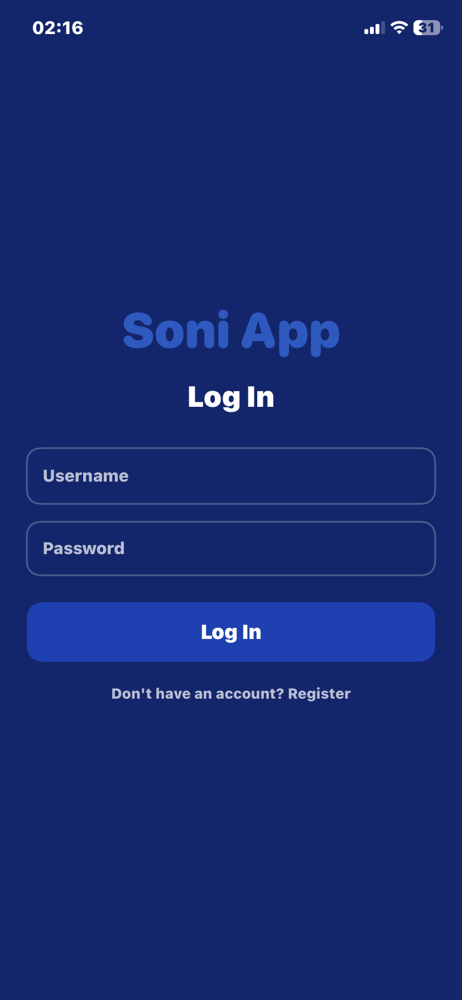</td>
      <td align="center"><b>Chat List</b><br>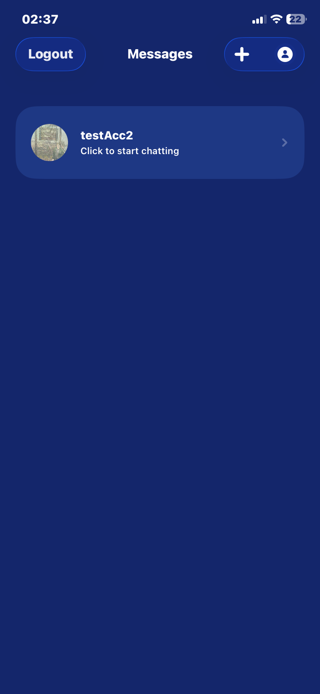</td>
      <td align="center"><b>Chat View</b><br>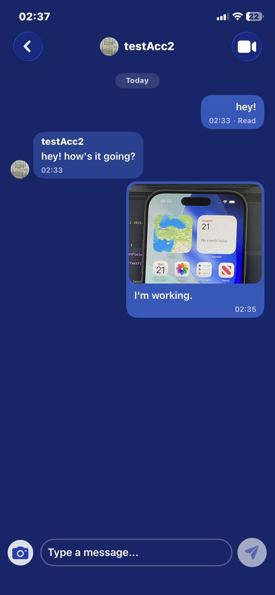</td>
      <td align="center"><b>Profile</b><br>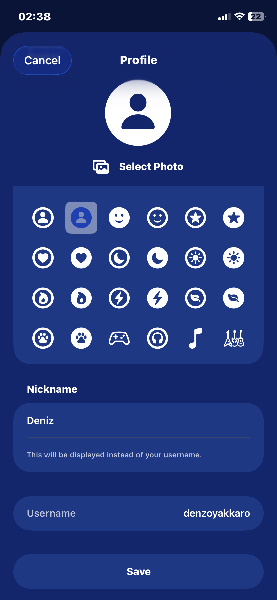</td>
    </tr>
    <tr>
      <td align="center"><b>Outgoing Call</b><br>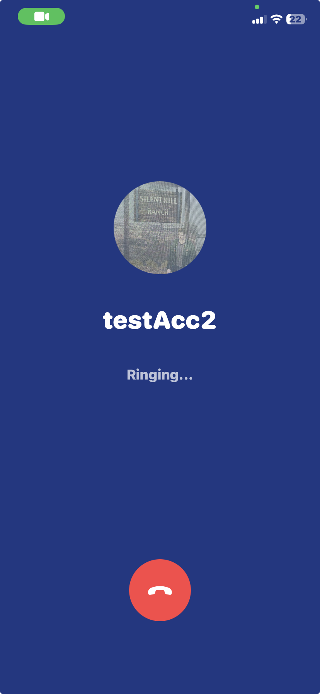</td>
      <td align="center"><b>Incoming Call</b><br>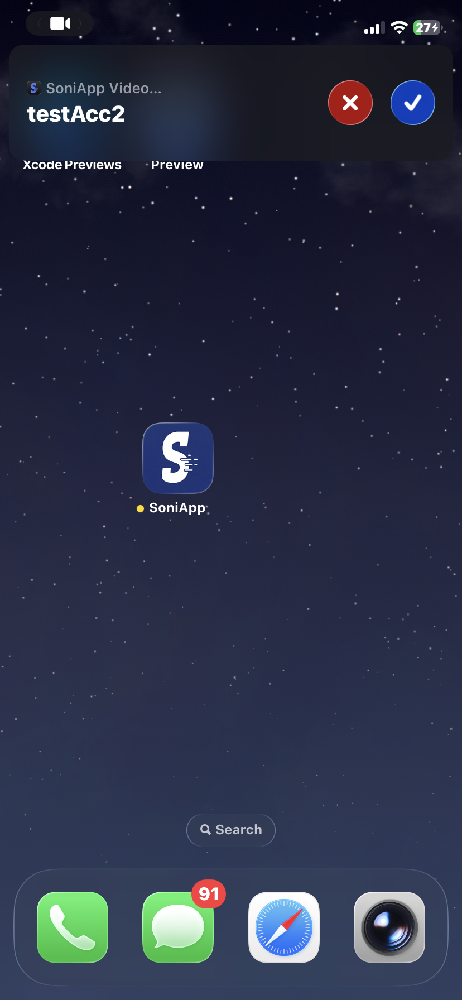</td>
      <td align="center"><b>Incoming (In-App)</b><br>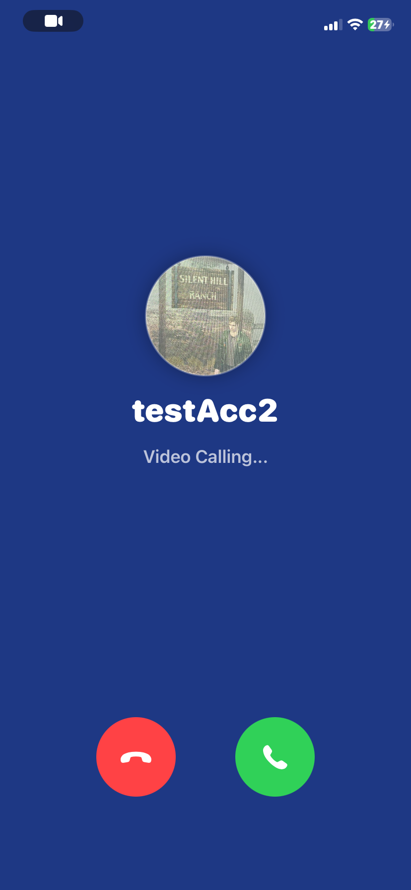</td>
      <td align="center"><b>Video Call</b><br>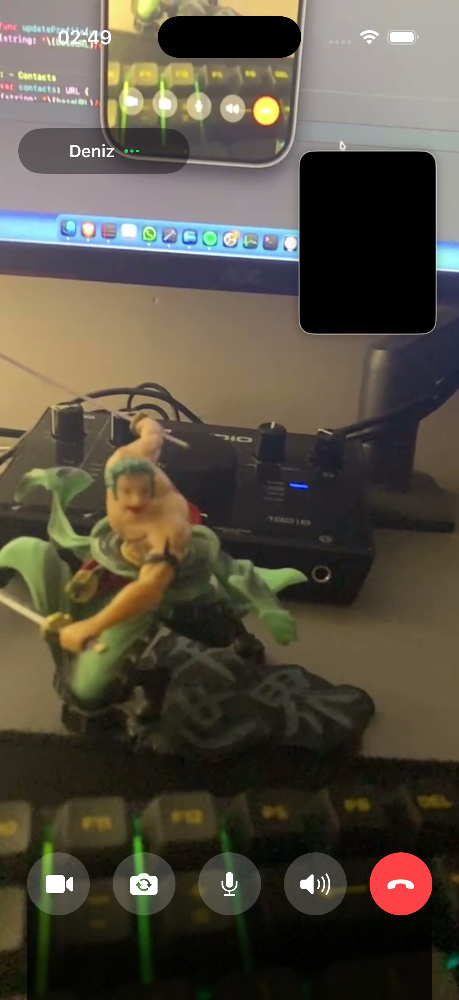</td>
    </tr>
  </table>
</div>

---

## Architecture

The iOS client follows the **MVVM (Model–View–ViewModel)** pattern with a service layer. Views are purely declarative SwiftUI, ViewModels handle business logic and state via `@Published` properties, and a dedicated Repository layer abstracts SwiftData persistence from the rest of the app.

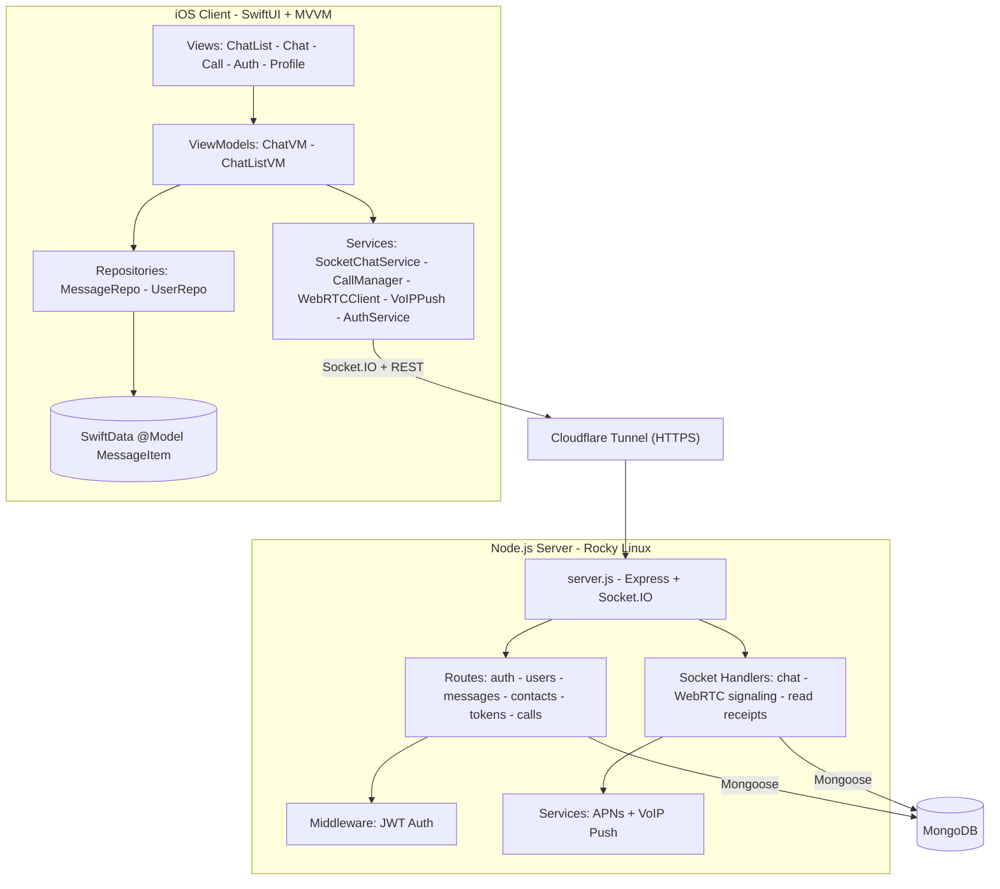

---

## Tech Stack

**iOS Client:**
- Swift 5, SwiftUI, SwiftData (`@Model`, `@Query`, `#Predicate`)
- Swift Concurrency (`async/await`, `@MainActor`)
- Combine (`PassthroughSubject`, `debounce`, `sink` — 11 reactive publishers)
- WebRTC (GoogleWebRTC)
- Socket.IO Client (SocketIO-Client-Swift)
- CallKit, PushKit, NWPathMonitor

**Backend:**
- Node.js, Express
- Socket.IO (real-time event layer)
- Mongoose + MongoDB
- `apn` (Apple Push Notification service)
- `multer` (multipart file uploads)

**Security:**
- `jsonwebtoken` — Stateless JWT authentication (issued on login, verified on every protected route)
- `bcryptjs` — Password hashing with salt (never stores plaintext passwords)
- Token-gated middleware for all user-facing API endpoints

**Infrastructure:**
- Self-hosted Rocky Linux VM
- Cloudflare Tunnel — zero-config HTTPS, no open ports on the server
- MongoDB with database-level user authentication

---

## How It Works

### Authentication & Security

1. **Registration:** Password is hashed with `bcryptjs` (10 salt rounds) before storing in MongoDB. Plaintext passwords are never persisted.
2. **Login:** Server verifies credentials via `bcrypt.compare()`, then issues a JWT containing `{ userId, username }` signed with a server-side secret. Token is valid for 365 days.
3. **Protected Routes:** The `authenticateToken` middleware intercepts requests, extracts the `Bearer` token from the `Authorization` header, and verifies it with `jwt.verify()`. If invalid or expired, the request is rejected with `401/403`.
4. **Session Persistence:** The iOS client stores the JWT in `UserDefaults` via `SessionStore`. On app launch, if a valid token exists, the user is automatically authenticated without re-login.

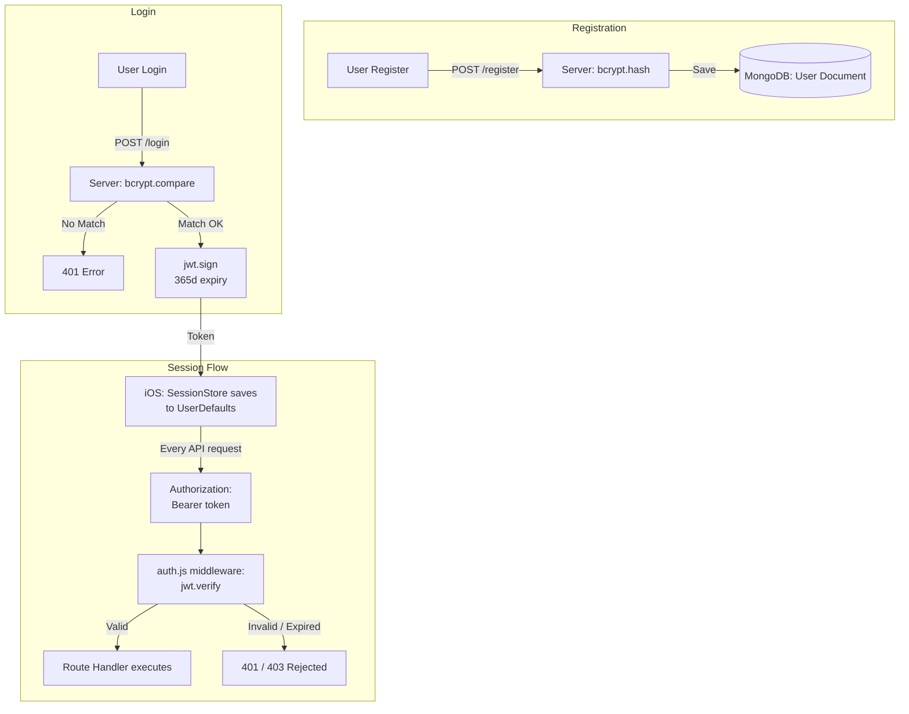

### Real-Time Messaging

1. User types a message → a `MessageItem` (SwiftData) is created locally with `.pending` status
2. If connected, the message is emitted via Socket.IO (`chat_message` event)
3. Server saves to MongoDB, broadcasts `receive_message` to all clients
4. Client receives the **server echo** → replaces the pending local message with the confirmed version (matched by `clientId`)
5. If offline at send time, the message stays `.pending` → `PendingMessageRetryService` automatically retries on reconnection

**Offline Queue:** Messages are persisted to SwiftData immediately, so they survive app kills. On reconnect, a Combine pipeline (`connectionStatePublisher` with `debounce`) triggers batch retry. Images are saved to `Documents/PendingImages/` first, uploaded to server on retry, then the socket emit fires with the server image URL.

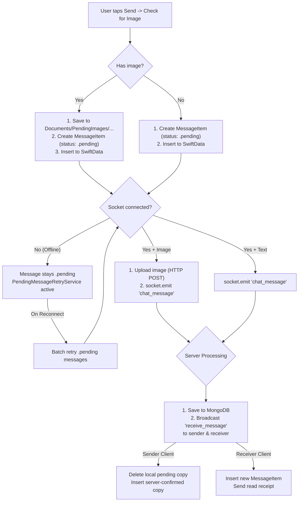

### Video Calling (WebRTC + CallKit + PushKit)

The call flow involves a 7-phase state machine (`CallPhase`):

```
idle → outgoingRinging → connecting → active → ended
idle → incomingRinging → connecting → active → ended
                                            → failed(reason)
```

**Outgoing Call:**
1. Caller creates WebRTC offer (SDP) → emits `call-user` via socket
2. Server stores the offer in `pendingOffers` Map and sends VoIP push via APNs to the callee's device
3. Offer is **retried every 2 seconds** until answered or timed out (30s)
4. Ring timeout fires after 30 seconds if no answer

**Incoming Call (Background/Killed):**
1. PushKit VoIP push wakes the app → `CallKitManager.reportIncomingCall()` shows native iOS call UI
2. On accept, the app checks if the SDP offer arrived via socket
3. If socket data is missing (cold boot race condition), it falls back to **HTTP polling** (`GET /api/calls/pending/:userId` with JWT auth) to fetch the offer from the server's `pendingOffers` Map
4. WebRTC answer is generated and sent back via socket

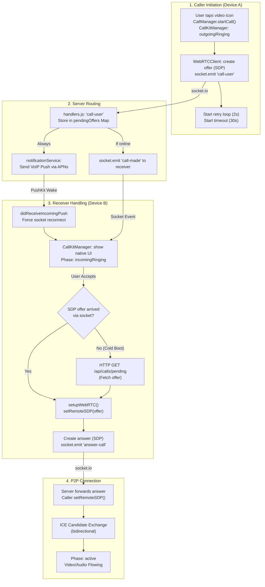

**Race Condition Handling:**
- **Glare Resolution:** When two users call each other simultaneously, the user with the lexicographically higher userId wins as caller; the other switches to receiver
- **Duplicate Push Protection:** If a VoIP push arrives for an already-ringing call, it's ignored
- **Busy Rejection:** If a call arrives while already in a call, CallKit is briefly shown and immediately ended
- **ICE Candidate Buffering:** Candidates arriving before remote SDP is set are queued in `pendingRemoteCandidates` and flushed after `setRemoteDescription` succeeds. On the server side, candidates for offline users are buffered in `pendingIceCandidates` and flushed on socket registration

**Audio Session Management:**
- CallKit controls the audio session lifecycle (activate/deactivate)
- If CallKit activates audio before WebRTC is initialized, the activation is flagged and re-applied after `setupWebRTC()`
- Speaker/earpiece toggle via `RTCAudioSession.overrideOutputAudioPort()`
- Camera is automatically disabled on background entry and re-enabled on foreground

### Network Resilience

`SocketChatService` uses `NWPathMonitor` to detect:
- **WiFi ↔ Cellular handoff:** Forces socket disconnect + reconnect when the network interface type changes (prevents zombie sockets)
- **Network loss → restore:** Reconnects socket when connectivity returns
- **App foreground:** Reconnects if socket was disconnected while in background

Socket.IO is configured with infinite reconnect attempts (`reconnectAttempts: -1`) and a 2-second retry interval.

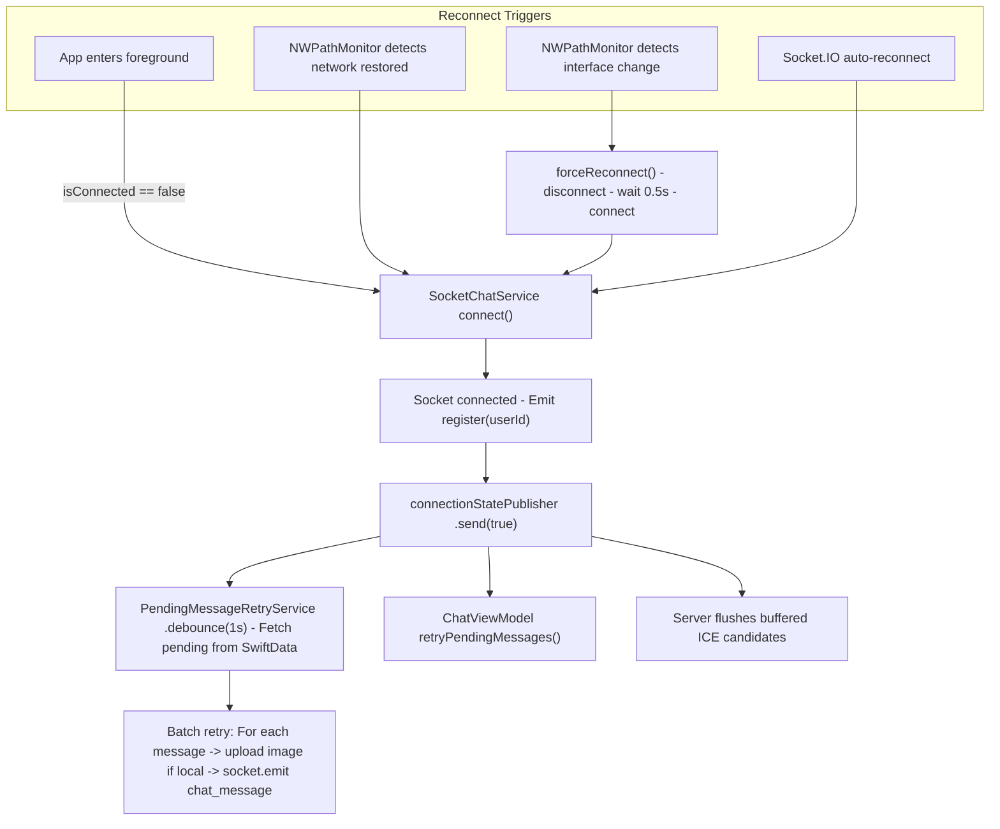

### Contacts & Profile Management

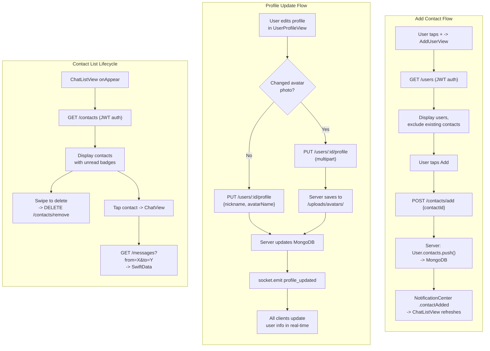

### Push Notification Suppression

Notifications are intelligently suppressed to avoid annoying the user:
- When the **chat list** is open (`isInChatList` flag) — all push banners are hidden
- When a **specific chat** is open — pushes from that sender are suppressed (matched by `currentChatPartnerId`)
- Pushes from other senders still display normally

### Read Receipts

1. When ChatView opens, all unread messages from the partner are marked as read locally and a `mark_as_read` socket event is emitted
2. Server updates MongoDB (`isRead: true`, `readAt: now`) and broadcasts a `read_receipt` event
3. The sender's client receives the receipt and updates the local SwiftData store
4. UI shows "· Read" with timestamp on the message bubble

---

## Challenges & Solutions

Real-world problems encountered during development and the solutions that were implemented:

| Challenge | Root Cause | Solution |
|---|---|---|
| **VoIP Cold Boot Race Condition** | PushKit wakes the app, but the socket isn't connected yet — the SDP offer never arrives via socket | Created an HTTP fallback endpoint (`GET /api/calls/pending/:userId`) that stores offers server-side in a `pendingOffers` Map. The app fetches via REST when socket data is missing. Combined with offer retry every 2 seconds. |
| **WebRTC Glare (Simultaneous Calls)** | Two users press "call" at the same time — both send offers, neither knows who should answer | Deterministic resolution via `userId` string comparison: the user with the lexicographically higher ID stays as caller, the other cancels their outgoing call and switches to receiver role |
| **Zombie Socket on Network Switch** | WiFi → Cellular transition leaves Socket.IO in "connected" state but the TCP connection is dead — messages stop flowing silently | `NWPathMonitor` tracks the active network interface type. When it changes (e.g., WiFi → Cellular), a `forceReconnect()` tears down the old socket and establishes a fresh connection |
| **CallKit + WebRTC Audio Timing** | CallKit activates the audio session before WebRTC is initialized — `RTCAudioSession.isAudioEnabled = true` has no effect because the peer connection doesn't exist yet | Flag (`audioSessionActivatedByCallKit`) records the early activation. After `setupWebRTC()` configures the audio session, the flag is checked and audio is re-enabled |
| **Offline Message Loss** | Socket disconnects mid-send — the message vanishes without the user knowing | SwiftData offline queue: messages are persisted locally with `.pending` status before socket emit. `PendingMessageRetryService` listens for reconnection events (debounced Combine pipeline) and batch-retries all pending messages |
| **Message Duplication (Server Echo)** | Server broadcasts to all clients including the sender — the sent message appears twice | `clientId` pattern: each outgoing message gets a UUID. When the server echo arrives, the local pending copy (matched by `clientId`) is deleted and replaced with the server-confirmed version |
| **ISP Proxy Interference** | Some ISPs route traffic through transparent proxies that corrupt or block direct API calls | `URLSessionConfiguration.connectionProxyDictionary = [:]` explicitly bypasses proxy configurations for all REST calls |
| **Push Token Delivery Timing** | APNs device token arrives via `AppDelegate` callback after `SessionStore` has already initialized — token never gets sent to server | Dual delivery: `AppDelegate` saves token to `UserDefaults` immediately. `DependencyContainer` reads from `UserDefaults` on startup and sends to server if user is already authenticated. Login flow also triggers a fresh token send. |

---

## Design Decisions

| Decision | Rationale |
|---|---|
| **SwiftData over Core Data** | Modern persistence with `@Model` macro, native SwiftUI integration, type-safe predicates with `#Predicate` |
| **Combine over async/await for socket events** | Socket events are continuous streams, not one-shot — `PassthroughSubject` maps naturally to event listeners. Used 11 dedicated publishers for clean separation |
| **DependencyContainer pattern** | Single `@StateObject` at app root wires all services. Avoids scattered singletons and enables protocol-based testing |
| **JWT over session-based auth** | Stateless authentication — server doesn't need to track sessions. Token is self-contained and verified on each request |
| **bcrypt over plain hashing** | Adaptive cost factor makes brute-force attacks computationally expensive. Salt is built into the hash output |
| **Server-side pendingOffers Map** | Solves the VoIP cold boot race condition — when PushKit wakes the app, the socket may not be connected yet. HTTP fallback fetches the SDP offer from server memory |
| **clientId echo pattern** | Each outgoing message gets a UUID `clientId`. When the server echoes it back, the local pending copy is replaced with the confirmed version. Prevents message duplication |
| **NWPathMonitor over Reachability** | First-party Apple API with interface-type granularity. Detects WiFi↔cellular transitions that leave sockets in a zombie state |
| **Cloudflare Tunnel over port forwarding** | No open ports on the Rocky Linux server. HTTPS termination and DDoS protection are handled at Cloudflare's edge |

---

## License

This project is open source and available under the [MIT License](LICENSE).
